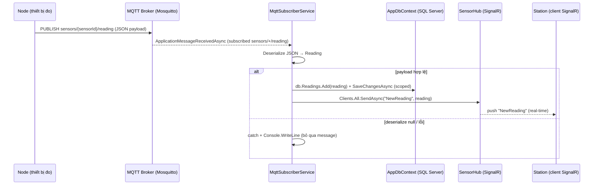
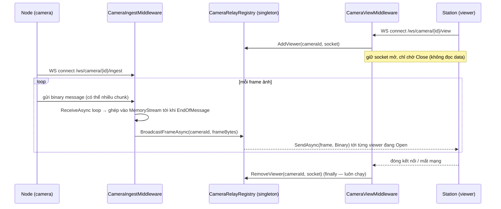
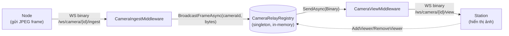

# BackendV2 — Sơ đồ kiến trúc: luồng Sensor & luồng Camera

Tài liệu mô tả 2 luồng dữ liệu chính trong `BackendV2`: **Sensor (MQTT → SignalR)** và **Camera (WebSocket relay)**.

---

## 1. Luồng Sensor (MQTT → DB → SignalR)

### Thành phần liên quan
- `MqttSubscriberService` (`BackgroundService`, singleton hosted service) — subscribe topic `sensors/+/reading` trên broker Mosquitto (`localhost:1883`)
- `AppDbContext` — lưu `Reading` vào DB (tạo `IServiceScopeFactory` scope mới mỗi message vì `DbContext` là scoped, không thể inject thẳng vào service singleton)
- `SensorHub` (`Hub`, rỗng — chỉ dùng làm kênh broadcast) — map tại `/hubs/sensor`
- `IHubContext<SensorHub>` — dùng để đẩy dữ liệu tới toàn bộ client đang kết nối SignalR

### Sequence diagram

### Ghi chú
- `MqttSubscriberService` chạy suốt vòng đời app (`Task.Delay(Timeout.Infinite)` sau khi subscribe) — kết nối MQTT chỉ thiết lập 1 lần lúc start.
- Mỗi message tạo 1 `IServiceScopeFactory.CreateScope()` mới để lấy `AppDbContext` — bắt buộc vì service là singleton còn `DbContext` là scoped.
- Lỗi parse/save chỉ log ra console, không rebroadcast, không throw — 1 message lỗi không làm sập subscriber loop.
- `SensorHub` không có method nào — chỉ là "ống" để `IHubContext` bơm dữ liệu ra client, client không gọi ngược lại hub.

---

## 2. Luồng Camera (WebSocket relay qua 2 middleware)

### Thành phần liên quan
- `CameraRelayRegistry` (singleton) — `ConcurrentDictionary<cameraId, ConcurrentDictionary<WebSocket, bool>>`, giữ danh sách viewer đang xem theo từng camera, có `AddViewer` / `RemoveViewer` / `BroadcastFrameAsync`
- `CameraIngestMiddleware` — nhận frame từ Node tại `/ws/camera/{cameraId}/ingest`
- `CameraViewMiddleware` — đăng ký Station làm viewer tại `/ws/camera/{cameraId}/view`
- Cả 2 middleware match route bằng `StartsWith` / `EndsWith` thủ công (không dùng route template/Regex), đăng ký sau `app.UseWebSockets()`

### Sequence diagram

### Component / data-flow diagram

### Ghi chú
- **Chiều dữ liệu 2 middleware khác nhau hoàn toàn**: Ingest = đọc frame + broadcast; View = chỉ đăng ký viewer + chờ Close, không đọc/parse dữ liệu ảnh.
- Registry là **in-memory, singleton** — không persist, mất frame nếu không có viewer nào đang mở tại thời điểm broadcast (không buffer/replay).
- `RemoveViewer` luôn nằm trong `finally` ở View middleware → đảm bảo dọn dẹp kể cả khi client rớt mạng đột ngột, không chỉ khi đóng sạch (`Close` message).
- Ghép frame trong Ingest dùng `do { ... } while (!result.EndOfMessage)` vì buffer nhận chỉ 8KB, 1 JPEG frame thường lớn hơn nên phải nhận nhiều chunk mới đủ 1 message hoàn chỉnh.
- Cả 2 middleware dùng `context.RequestAborted` làm `CancellationToken` cho `ReceiveAsync`/`SendAsync` — tự hủy khi client ngắt kết nối HTTP.

---

## So sánh nhanh 2 luồng

| | Sensor | Camera |
|---|---|---|
| Giao thức nhận từ Node | MQTT (pub/sub qua broker) | WebSocket (custom middleware) |
| Nơi lưu trữ | SQL Server (`Readings` table) | Không lưu — chỉ relay trực tiếp |
| Cách phát tới client | SignalR Hub (`Clients.All.SendAsync`) | WebSocket binary trực tiếp tới từng viewer |
| Trạng thái giữ ở đâu | Không giữ danh sách client thủ công (SignalR tự quản lý) | `CameraRelayRegistry` tự quản lý viewer theo `cameraId` |
| Độ bền dữ liệu | Có (ghi DB trước khi broadcast) | Không (mất nếu không ai đang xem) |